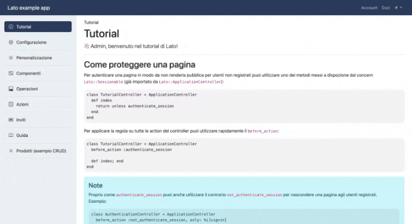

# Lato

[](https://badge.fury.io/rb/lato)

Lato is a Rails Engine to deliver a full featured web panel for your [Rails](https://rubyonrails.org/) application.

This gem includes:
- User management with **full authentication system** (signin, signup, recover password, email validation, Google Authenticator multi-factor authentication, ETH wallet connection) and **account management** (user settings, password change, email change, etc.);
- **Web interface** built with [Bootstrap](https://getbootstrap.com/) and [Bootstrap Icons](https://icons.getbootstrap.com/);
- **UI components integrated with Rails** (data tables, forms, modals, async job executions etc.);

The gem is **agnostic to the application stack**. You can use it with different databases (PostgreSQL, MySQL, SQLite), different Job processors (Solid queue, Sidekiq, Delayed Job, etc.), different cache systems (Redis, Memcached, etc.).

The gem is designed to be easily **customizable and extendable**. You can fully customize the UI and the functionalities of the panel. You can also add new functionalities and components to the panel on the main application or develop new engines to extend the panel.

The gem is ready to be used with the **latest Rails 7+** features like **[ESM import maps](https://github.com/rails/importmap-rails)**, **[Turbo](https://turbo.hotwired.dev/)** and **[Stimulus](https://stimulus.hotwired.dev)**. The front-end is designed to be responsive, mobile friendly and accessible.



## Full documentation

The full documentation is available at: 👉 👉 [THIS LINK](https://auuu.link/s/gh-lato) 👈 👈

You can also use the [Lato AI Agent](http://lato.gregoriogalante.com/AI.html) directly on your browser to generate code and get helps with the gem.

## Eco-system
The idea behind Lato is to create an eco-system of engines that can improve the functionalities of the panel. The following engines are already available:

- [LatoSpaces](https://github.com/Lato-org/lato_spaces): A simple engine to manage multiple workspaces in the panel with user invitation and workspace roles;
- [LatoSettings](https://github.com/Lato-org/lato_settings): A simple engine to manage application settings from the UI panel;

## Installation
Add required dependencies to your application's Gemfile:

```ruby
# Use JavaScript with ESM import maps [https://github.com/rails/importmap-rails]
gem "importmap-rails" # NOTE: Probably already installed in default rails 7+ project

# Hotwire's SPA-like page accelerator [https://turbo.hotwired.dev]
gem "turbo-rails" # NOTE: Probably already installed in default rails 7+ project

# Hotwire's modest JavaScript framework [https://stimulus.hotwired.dev]
gem "stimulus-rails" # NOTE: Probably already installed in default rails 7+ project

# Use Sass to process CSS
gem "sassc-rails"

# Use lato as application panel
gem "lato"
```

Install gem and run required tasks:

```bash
$ bundle
$ rails active_storage:install
$ rails lato:install:application
$ rails lato:install:migrations
$ rails db:migrate
```

Mount lato routes on the **config/routes.rb** file:

```ruby
Rails.application.routes.draw do
  mount Lato::Engine => "/lato"

  # ....
end
```

Import Lato Scss on **app/assets/stylesheets/application.scss** file:
```scss
@import 'lato/application';

// ....
```

Import Lato Js on **app/javascript/application.js** file:
```js
import "lato/application";

// ....
```

Setup I18n on the **config/application.rb** file:

```ruby
module MyApplication
  class Application < Rails::Application
    config.i18n.available_locales = [:it, :en]
    config.i18n.default_locale = :it

    # ...
  end
end

```

### Extra tasks
Lato integrates by default a basic PWAs manifest and service worker. To re-generate them with all required assets follow these steps:

1. Complete the configuration of lato on a custom initializer (see [configuration](https://github.com/lato-org/lato/blob/main/lib/lato/config.rb) options for more details)
2. Add an icon.png file on **public/icon.png** with minimum size of 512x512px
3. Run the following commands:

```bash
$ rails lato:generate:favicon
$ rails lato:generate:pwa
```

## Development

Clone repository, install dependencies, run migrations and start:

```shell
$ git clone https://github.com/lato-org/lato
$ cd lato
$ bundle
$ rails db:migrate
$ rails db:seed
$ foreman start -f Procfile.dev
```

### Publish

This script will publish the gem to rubygems.org. Make sure you have the correct permissions and that you are logged in to your rubygems account.

```shell
$ ruby ./bin/publish.rb
```

### Generate documentation

This script will generate the documentation for the gem by exporting the Rails rendered views to HTML files. The documentation will be generated in the **docs** folder.

Make sure to have the server running on port 3000 before running the script.

```shell
$ ruby ./bin/generate_docs.rb
```

## License
The gem is available as open source under the terms of the [MIT License](https://opensource.org/licenses/MIT).
